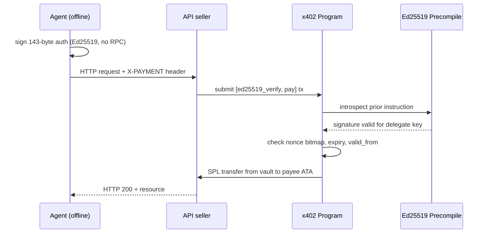

<p align="center">
  <a href="https://github.com/Curved-labs/x402/blob/main/LICENSE">
    
  </a>
  <a href="https://github.com/Curved-labs/x402/actions/workflows/ci.yml">
    
  </a>
  <a href="https://github.com/Curved-labs/x402/releases">
    
  </a>
  <a href="https://github.com/Curved-labs/x402/commits/main">
    
  </a>
</p>

# x402

Payment infrastructure for autonomous agents on Solana.

An agent signs 143 bytes. No Solana SDK, no RPC connection, no account, no gas. Any relayer settles it on-chain. No one can refuse.

---

## The problem

AI agents need to pay for APIs, compute, and data. Existing x402 implementations (Coinbase, etc.) route every payment through a facilitator server. The facilitator verifies, settles, and takes a fee. If it refuses, the payment does not settle.

This creates three problems for agents:

1. **Agents cannot open facilitator accounts.** Facilitators require identity verification. An autonomous agent running in a sandbox has no identity to verify.
2. **Agents cannot install chain SDKs.** Transaction-based payment requires `@solana/web3.js`, an RPC endpoint, a recent blockhash, and SOL for gas. That is a heavy dependency set for a process whose job is to call an API.
3. **Agents cannot tolerate censorship.** If a facilitator decides to block an agent, every payment the agent signed becomes worthless. The agent's entire budget is frozen by a single party's decision.

## The solution

Remove the facilitator. The on-chain program does its job.

The payer signs a 143-byte Ed25519 message (not a transaction). The message commits to: who pays, who receives, which token, how much, a nonce, and an expiry window. Any relayer, including the payee, submits this to the on-chain program, which reconstructs the same 143 bytes, verifies the signature against the escrow's delegate key, checks the nonce bitmap, enforces the time window, and transfers SPL tokens.

| | Facilitator model | x402 (this program) |
|---|---|---|
| Account required | Yes (KYC) | No |
| Chain connection at signing | Yes (needs blockhash) | No |
| Payer-side dependencies | `@solana/web3.js`, RPC | `node:crypto` alone |
| Can be censored | Yes (facilitator refuses) | No (payee self-relays) |
| Per-transaction fee | Facilitator markup | 0 (gas only, ~6,800 lamports) |
| Signature validity | ~60s (blockhash expiry) | Arbitrary (expiry field) |

## For agent developers

### Pay for an API with zero dependencies

```typescript
import { pay } from "@curved/x402/zero";

const response = await pay(secretKey, "https://api.example.com/premium");
// response is a standard fetch Response, already paid
// the agent spent: 0 SOL, 0 npm dependencies
```

### Set a spend policy on the agent

```typescript
import { wallet } from "@curved/x402/wallet";

const fetch = wallet({
  keyFile: ".curved-key.json",
  policy: {
    maxPerCall:  100_000n,      // 0.1 USDC ceiling per request
    maxPerDay:   5_000_000n,    // 5 USDC daily budget
    allow: ["api.example.com"], // hostname allowlist
  },
});

const res = await fetch("https://api.example.com/premium");
// PolicyError thrown BEFORE signing if limits exceeded
```

### Set up the agent's escrow

```bash
npx @curved/x402 init
# creates key, ATA, escrow, deposits, prints .env

npx @curved/x402 status
# USDC balance:  4.75 (escrow) / 0.25 (wallet)
# Can pay:       yes, for about 47 calls at 0.1 USDC
```

## For API sellers

### Protect an endpoint

```typescript
import { wall } from "@curved/x402";
import express from "express";

const app = express();

app.use("/api/premium", wall({
  payee: "SELLER_PUBKEY",
  mint: "USDC_MINT",
  amount: 100_000,           // 0.1 USDC (6 decimals)
  rpc: "https://api.devnet.solana.com",
}));

app.get("/api/premium", (req, res) => {
  res.json({ data: "paid content" });
});
```

The wall middleware returns an x402 quote on unpaid requests and verifies + settles paid ones. The seller receives USDC directly. No facilitator takes a cut.

## Custody split

The escrow has two keys:

- **Authority**: deposits, withdraws, rotates the delegate. This is the cold key. Keep it offline.
- **Delegate**: signs payment authorizations. This is the agent's hot key.

If the agent key is compromised, the attacker can only sign authorizations against the existing escrow balance. The authority revokes the delegate (`set_delegate` to zero address), withdraws remaining funds, and rotates to a new agent key. The attacker never touches the authority key.

```
Escrow (PDA: ["escrow", authority])
  authority: Pubkey     // owner, can deposit/withdraw
  delegate:  Pubkey     // agent key, can sign authorizations
  bump:      u8

Vault (PDA: ["vault", escrow, mint])
  SPL TokenAccount       // holds deposited tokens

NonceWindow (PDA: ["nonce", authority, window_index])
  bits: [u8; 128]       // 1024 nonces per account
```

## Authorization format (143 bytes)

```
 0..15   AUTH_DOMAIN     "X402SOL_AUTH_V1"
15..47   payer           Pubkey (escrow authority)
47..79   payee           Pubkey (recipient)
79..111  mint            Pubkey (SPL token mint)
111..119 amount          u64 LE
119..127 nonce           u64 LE
127..135 valid_from      i64 LE (0 = immediate)
135..143 expiry          i64 LE (unix seconds)
```

The payer signs these 143 bytes with Ed25519 (no prehash). The on-chain program reconstructs the same bytes from instruction arguments and verifies them against the delegate's public key via the Ed25519 native precompile.

## Architecture



## Components

| Component | Status | Path |
|---|---|---|
| Settlement program | Stable | `programs/x402/` |
| TypeScript SDK | Stable | `sdk/src/` |
| Zero-dependency client | Stable | `sdk/zero/client.mjs` |
| Agent wallet with policy | Stable | `sdk/zero/wallet.mjs` |
| Wall middleware (seller) | Stable | `sdk/src/wall.ts` |
| CLI (escrow setup) | Beta | `sdk/src/cli.ts` |
| Rust client + relay | Alpha | `client/` |

## Performance

| Metric | Value | Conditions |
|---|---|---|
| Authorization signing | 3 ms | Ed25519, node:crypto, M-series Mac |
| Single settlement | 882 ms | Devnet, payee self-relay, submit to confirmed, median of 10 |
| Single settlement | 980 ms | Devnet, third-party relay, submit to confirmed, median of 10 |
| Single settlement | 503 ms | Localnet, submit to confirmed |
| 64 concurrent (same window) | 313 ms total | Same nonce window account |
| On-chain cost | 6,794 lamports | Signature + amortized nonce rent |
| Authorization size | 143 bytes | Fixed, no variable fields |
| Zero client bundle | 0 bytes npm | Only node:crypto import |

## Test results

```
suite.ts          15/15  custody split, outsider sig, underpay, wrong payee,
                         replay, expiry, concurrent settlement, escrow overdraft,
                         revocation, HTTP wall, fetchWall

wallet.ts          8/8   per-call limit, daily limit, lifetime limit,
                         hostname allowlist, confirm hook, ledger persistence

concurrent.ts     64/64  same-window burst (313ms), cross-window burst,
                         balance reconciliation after parallel settlement

subscription.ts    4/4   valid_from enforcement, scheduled payment chains
```

## Build

```bash
git clone https://github.com/Curved-labs/x402.git
cd x402

# on-chain program (requires Anchor 0.31+)
anchor build

# TypeScript SDK
cd sdk && npm install && npm run build

# Rust client (separate workspace, uses agave SDK 3.x)
cd client && cargo build --release
```

## Deployments

| Network | Program ID | Explorer |
|---|---|---|
| Devnet | `12wgXGsPik37Sb2UViocZqLuBrSGZXPgsNtjM8K1yZ8Y` | [Solana Explorer](https://explorer.solana.com/address/12wgXGsPik37Sb2UViocZqLuBrSGZXPgsNtjM8K1yZ8Y?cluster=devnet) |

## Error codes

| Code | Hex | Name | Cause |
|---|---|---|---|
| 6000 | 0x1770 | MissingSig | No Ed25519 verify instruction before pay |
| 6001 | 0x1771 | BadSigIx | Malformed Ed25519 instruction data |
| 6002 | 0x1772 | WrongSigner | Auth signed by wrong key (not escrow delegate) |
| 6003 | 0x1773 | WrongAuth | Auth fields do not match instruction args |
| 6004 | 0x1774 | Expired | Current time > expiry |
| 6005 | 0x1775 | NonceSpent | Nonce bit already set (replay) |
| 6006 | 0x1776 | NotAuthority | Caller is not the escrow authority |
| 6007 | 0x1777 | DelegateRevoked | Escrow delegate set to default pubkey |
| 6008 | 0x1778 | NotYetValid | Current time < valid_from |

## Project structure

```
x402/
  programs/x402/
    src/lib.rs                 settlement program
  sdk/
    src/
      core.ts                  instruction builders, PDA derivation, relay
      wall.ts                  seller middleware (express + fetch)
      cli.ts                   npx @curved/x402 init|status
      client.ts                payer-side x402 handshake
      protocol.ts              x402 quote/response types
      server.ts                server-side quote builder
    zero/
      client.mjs               zero-dependency payer (node:crypto only)
      wallet.mjs               policy-bounded agent wallet
    test/                      91 integration tests
  client/
    src/
      lib.rs                   Rust authorization + verification
      main.rs                  single-shot payment binary
      bin/s2_http.rs           HTTP relay server
      bin/s3_relay.rs          batch relay binary
  docs/
    authorization.md           143-byte format specification
    nonce-bitmap.md            Permit2-style nonce design
    custody-split.md           owner vs delegate key model
  examples/
    pay-once.mjs               single payment example
    wall-express.mjs           express server with wall
    agent-budget.mjs           agent with daily budget
```

## Links

- Documentation: https://curved.pro/docs
- Security: [report privately](https://github.com/Curved-labs/x402/security/advisories/new)

## Contributing

See [CONTRIBUTING.md](CONTRIBUTING.md) for development setup and PR guidelines.

## License

[MIT](LICENSE)
